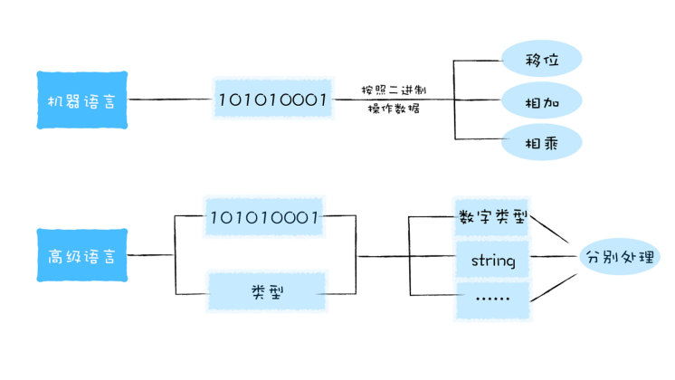
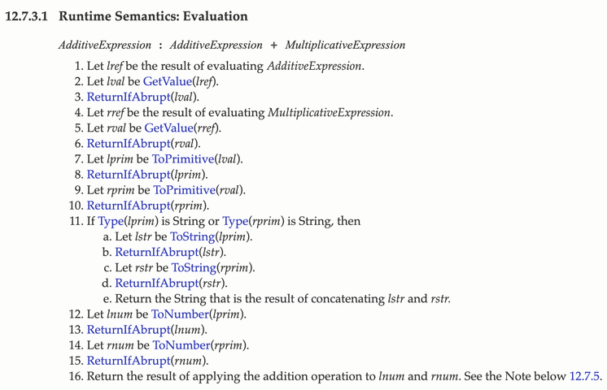

# 课程备课文档#200811#：V8是怎么实现1+'2'的，为什么1.toString会报错？

> 大家在学JavaScript 面向对象时，往往会有几个疑惑：
1：为什么 JavaScript（直到 ES6）有对象的概念，但是却没有像其他的语言那样，有类的概念呢；
2：为什么在 JavaScript 对象里可以自由添加属性，而其他的语言却不能呢？

甚至，在一些争论中，有人强调：JavaScript 并非 "面向对象的语言"，而是"基于对象的语言"。究竟是面向对象还是基于对象这两派谁都说服不了谁。

实际上，基于对象和面向对象两个形容词都出现在了 JavaScript 标准的各个版本当中。我们可以先看看 JavaScript 标准对基于对象的定义，这个定义的具体内容是："语言和宿主的基础设施由对象来提供，并且 JavaScript 程序即是一系列互相通讯的对象集合"。

这里的意思根本不是表达弱化的面向对象的意思，反而是表达对象对于语言的重要性。

**我们首要任务就是去理解面向对象和 JavaScript 中的面向对象究竟是什么。**

## 什么是面向对象？

在《面向对象分析与设计》这本书中，作者 替我们做了总结，他认为，从人类的认知角度来说，对象应该是下列事物之一：
- 1. 一个可以触摸或者可以看见的东西；
- 2. 人的智力可以理解的东西；
- 3. 可以指导思考或行动（进行想象或施加动作）的东西。

有了对象的自然定义后，我们就可以描述编程语言中的对象了。在不同的编程语言中，设计者也利用各种不同的语言特性来抽象描述对象，最为成功的流派是使用"类" 的方式来描述对象，这诞生了诸如 C++、Java 等流行的编程语言。而 JavaScript 早年却选择了一个更为冷门的方式：原型。这是我在前面说它不合群的原因之一。

JavaScript 推出之时受管理层之命被要求模仿 Java，所以，JavaScript 创始人 Brendan Eich 在 "原型运行时" 的基础上引入了 new、this 等语言特性，使之"看起来更像 Java"。 这也就造就了JavaScript这个古怪的语言。

首先我们来了解一下 JavaScript 是如何设计对象模型的。

## JavaScript 对象的特征

不论我们使用什么样的编程语言，我们都先应该去理解对象的本质特征（参考 Grandy Booch《面向对象分析与设计》）。总结来看，对象有如下几个特点。

• 对象具有唯一标识性：即使完全相同的两个对象，也并非同一个对象。
• 对象有状态：对象具有状态，同一对象可能处于不同状态之下。
• 对象具有行为：即对象的状态，可能因为它的行为产生变迁。

我们先来看第一个特征，对象具有唯一标识性。一般而言，各种语言的对象唯一标识性都是用内存地址来体现的， 对象具有唯一标识的内存地址，所以具有唯一的标识。

所以我们都应该知道，任何不同的 JavaScript 对象其实是互不相等的，我们可以看下面的代码，o1 和 o2 初看是两个一模一样的对象，但是打印出来的结果却是 false。
```
var o1 = { a: 1 }; 
var o2 = { a: 1 }; 
console.log(o1 == o2); // false
```
关于对象的第二个和第三个特征"状态和行为"，不同语言会使用不同的术语来抽象描述它们，比如 C++ 中称它们为"成员变量"和"成员函数"，Java 中则称它们为"属性"和"方法"。

在 JavaScript 中，将状态和行为统一抽象为"属性",这是因为考虑到 JavaScript 中将函数设计成一种特殊对象所以 JavaScript 中的行为和状态都能用属性来抽象。

下面这段代码其实就展示了普通属性和函数作为属性的一个例子，其中 o 是对象，d 是一个属性，而函数 f 也是一个属性，尽管写法不太相同，但是对 JavaScript 来说，d 和 f 就是两个普通属性。
```
   var o = {        
     d: 1,        
     f() {            
       console.log(this.d);        
     }        
   };
```
所以，总结一句话来看，在 JavaScript 中，对象的状态和行为其实都被抽象为了属性。

**在实现了对象基本特征的基础上, 我认为，JavaScript 中对象独有的特色是：对象具有高度的动态性，这是因为 JavaScript 赋予了使用者在运行时为对象添改状态和行为的能力。**

比如，JavaScript 允许运行时向对象添加属性，这就跟绝大多数基于类的、静态的对象设计完全不同。如果你用过 Java 或者其它别的语言，肯定会产生跟我一样的感受。

下面这段代码就展示了运行时如何向一个对象添加属性，一开始我定义了一个对象 o，定义完成之后，再添加它的属性 b，这样操作是完全没问题的。
```
var o = { a: 1 }; 
o.b = 2;
console.log(o.a, o.b); //1 2
```
为了提高抽象能力，JavaScript 的属性被设计成比别的语言更加复杂的形式，它提供了数据属性和访问器属性（getter/setter）两类。

## JavaScript 对象的两类属性

**对 JavaScript 来说，属性并非只是简单的名称和值，JavaScript 用一组特征（attribute）来描述属性（property）。**

先来说第一类属性，数据属性。它比较接近于其它语言的属性概念。数据属性具有四个特征。
• value：就是属性的值。
• writable：决定属性能否被赋值。
• enumerable：决定 for in 能否枚举该属性。
• configurable：决定该属性能否被删除或者改变特征值。

在大多数情况下，我们只关心数据属性的值即可。第二类属性是访问器（getter/setter）属性，它也有四个特征。
- getter：函数或 undefined，在取属性值时被调用。
- setter：函数或 undefined，在设置属性值时被调用。

访问器属性使得属性在读和写时执行代码，它允许使用者在写和读属性时，得到完全不同的值，它可以视为一种函数的语法糖。

讲到了这里，如果你理解了对象的特征，也就可以理解为什么会有 "JavaScript 不是面向对象" 这样的说法了。

这是由于 JavaScript 的对象设计跟目前主流基于类的面向对象差异非常大。可事实上，这样的对象系统设计虽然特别，JavaScript 语言标准也已经明确说明，JavaScript 是一门面向对象的语言。

## 类型系统
接下来继续来聊另一个非常重要的概念，同时也是很容易被大家忽略的内容，那就是 JavaScript 中的'类型系统'。

对机器语言来说，所有的数据都是一堆二进制代码，CPU 处理这些数据的时候，并没有类型的概念，CPU 所做的仅仅是移动数据，比如对其进行移位，相加或相乘。

而在高级语言中，我们都会为操作的数据赋予指定的类型，类型可以确认一个值或者一组值具有特定的意义和目的。所以，类型是高级语言中的概念。


比如在 C/C++ 中，你需要为要处理的每条数据指定类型，这样定义变量：
```
int count = 100;
char* name = "zwj";
```
C/C++ 编译器负责将这些数据片段转换为供 CPU 处理的正确命令，通常是二进制的机器代码。
在JavaScript中引擎可以根据数据自动推导出类型，因此就不需要直接指定变量的类型。
var counter = 100;
const name = "ZWJ";
通用的类型有数字类型、字符串、Boolean 类型等等，引入了这些类型之后，编译器或者解释器就可以根据类型来限制一些有害的或者没有意义的操作。

比如在 Python 语言中，如果使用字符串和数字相加就会报错，因为 Python 觉得这是没有意义的。而在 JavaScript 中，字符串和数字相加是有意义的，可以使用字符串和数字进行相加的。

**再比如，你让一个字符串和一个字符串相乘，这个操作是没有意义的，所有语言几乎都会禁止该操作。
每种语言都定义了自己的类型，还定义了如何操作这些类型，另外还定义了这些类型应该如何相互作用，我们就把这称为类型系统。**

## 关于类型系统

直观地理解，一门语言的类型系统定义了各种类型之间应该如何相互操作，比如，两种不同类型相加应该如何处理，两种相同的类型相加又应该如何处理等。还规定了各种不同类型应该如何相互转换，比如字符串类型如何转换为数字类型。

# V8是怎么认为字符串和数字相加是有意义？

接下来我们就可以来看看 V8 是怎么处理 1+"2"的了。 之前我们提到过它并不会报错而是输出字符串"12".

当有两个值相加的时候，比如:
```
a+b
```
V8 会严格根据 ECMAScript 规范来执行操作。ECMAScript 是一个语言标准，JavaScript 就是 ECMAScript 的一个实现，比如在 ECMAScript 就定义了怎么执行加法操作，如下所示：


通俗地理解:

如果 Type(lprim) 和 Type(rprim) 中有一个是 String，则：

a. 把 ToString(lprim) 的结果赋给左字符串 (lstr)；
b. 把 ToString(rprim) 的结果赋给右字符串 (rstr)；
c. 返回左字符串 (lstr) 和右字符串 (rstr) 拼接的字符串。

如果是其他的(对象) V8 会提供了一个 ToPrimitve 方法，其作用是将 a 和 b 转换为原生数据类型，其转换流程如下：
• 先检测该对象中是否存在 valueOf 方法，如果有并返回了原始类型，那么就使用该值进行强制类型转换；
• 如果 valueOf 没有返回原始类型，那么就使用 toString 方法的返回值；
• 如果 vauleOf 和 toString 两个方法都不返回基本类型值，便会触发一个 TypeError 的错误。

当 V8 执行 1+"2" 时，因为这是两个原始值相加，原始值相加的时候，如果其中一项是字符串，那么 V8 会默认将另外一个值也转换为字符串，相当于执行了下面的操作：
```
Number(1).toString() + "2"
```
**这个过程还有另外一个名词叫装箱转换。**

### 关于装箱转换

> 每一种基本类型 Number、String、Boolean在对象中都有对应的构造函数，所谓装箱转换，正是把基本类型转换为对应的对象，它是类型转换中一种相当重要的种类。

在看一个例子：
```
1.toString(); //报错
```
这里会直接报错，原因如下。

### 数字直接量

原因是JavaScript 规范中规定的数字直接量可以支持四种写法：十进制数、二进制整数、八进制整数和十六进制整数。

十进制的 Number 可以带小数，小数点前后部分都可以省略，但是不能同时省略，我们看几个例子：
```
.01
12.
12.01
```
这都是合法的数字直接量。这里就有一个问题，也是我们刚刚提出的报错问题：
```
1.toString();
```
这时候1. toString()会被当作成一个带有小数的数字整体。所以我们要把点单独成为一个 token(语义单元)，就要加入空格，这样写：
```
1 .toString();
(1).toString();
```
此时就不会报错了。

但是为什么1能调用tostring方法， 1不是原始值吗？  

这个过程就是经历了装箱转换，在遇到(1).toString() 根据基本类型 Number 这个构造函数转换成一个对象。

### 围绕拆箱 装箱 转换可以写出很多有意思的代码。
```
{}+[]
• 以{}开头的会被解析为语句块
• 此时+为一元操作符，非字符串拼接符
• []会隐式调用toString()方法，将[]转化为原始值 ''
• +'' 被转化为数字0
• 扩展：如果将其用()括起来，即({}+[])，此时会显示"[object Object]"，因为此时{}不再被解析为语句块
[]+{}
• []会隐式调用toString()方法，将[]转化为原始值 ''
• {}会隐式调用toString()方法，将{}转化为原始值"[object Object]"
• +为字符串拼接符
[]+[]
• []会隐式调用toString()方法，将[]转化为原始值 ''
{}+{}
• 以{}开头的会被解析为语句块，即第一个{}为语句块 
• 此时+为一元操作符，非字符串拼接符
• 第二个{}会隐式调用toString()方法，将{}转化为原始值"[object Object]"
• +"[object Object]" 输出 NaN
•  扩展 在chrome 浏览器中输出"[object Object][object Object]"
```

** 前几年比较恶心的面试题。**
```
([][[]]+[])[+!![]]+([]+{})[!+[]+!![]]
问题分解：
左  ([][[]]+[])[+!![]]
拆分
[+!![]]
!![]       => true
[+!![]]  => 1
拆分
([][[]]+[])
[][0]      => undefined
undefined+[] =>"undefined"
输出："undefined"[1]
右
([]+{})[!+[]+!![]]
([]+{})    => "[object Object]"
拆
[!+[]+!![]]
!![]  => true => 1
+[]    => 0
!0      => 1
[1+1] => 2
输出："[object Object]"[2]
最后："undefined"[1]+"[object Object]"[2]  ==> nb
```

